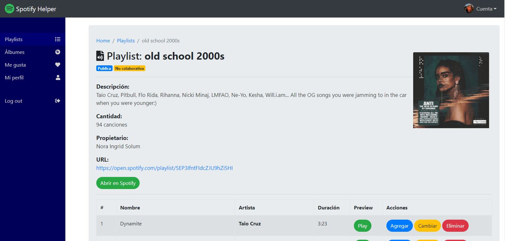
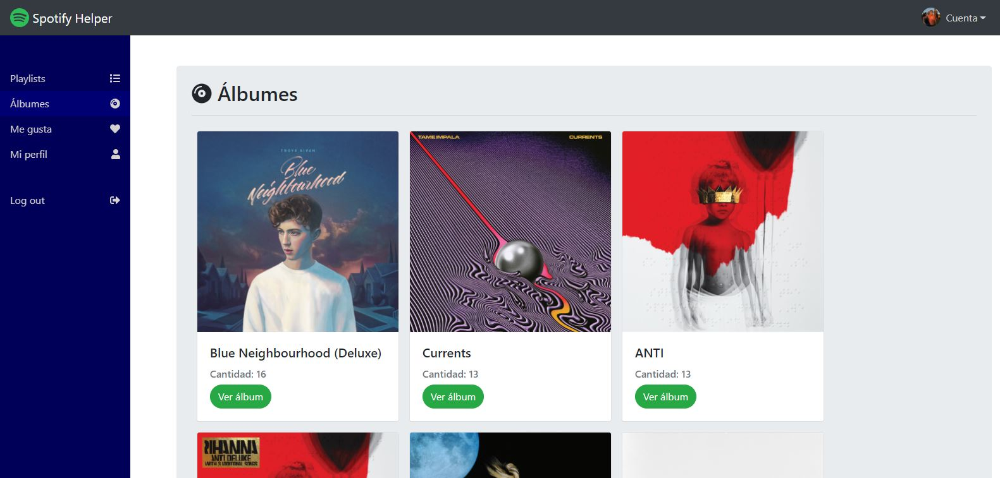
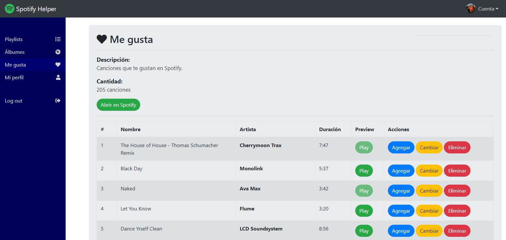

# Spotify Helper

> App para poder visualizar tus playlists, álbumes y canciones que te gustan. Además cuenta con las funciones de reproducir una preview y cambiar canciones entre playlists, borrándola en una y agregándola en otra.

> Esta app está publicada en [Netlify](https://spotify-helper.netlify.app/) (https://spotify-helper.netlify.app/).

# 
# 
# 
# 
