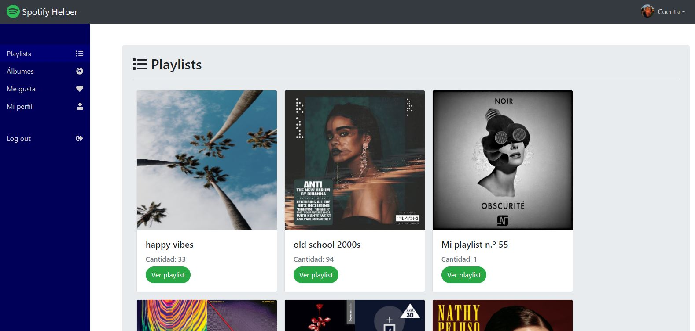

# Spotify Helper

> App para poder visualizar tus playlists, álbumes y canciones que te gustan. Además cuenta con la función de cambiar canciones entre playlists, borrándola en una y agregándola en otra.

Este sitio está publicado en [Netlify](https://spotify-helper.netlify.app/) (https://spotify-helper.netlify.app/).

# 
